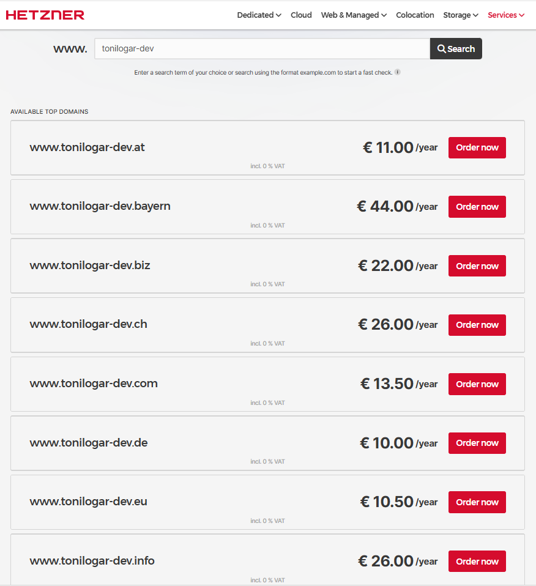

# Not everything is customizable...

## Index

1. [Create Hetzner user](#1-create-hetzner-user)
2. [Buy domain](#2-buy-domain)
3. [Create GitHub repository](#3-create-github-repository)  
4. [Clone repository in local machine](#4-clone-repository-in-local-machine)


---

## 1 Create Hetzner user  

[Create user or login→](https://accounts.hetzner.com/login) 


[←Index](#index)

## 2 Buy domain  
### Why buy "Real" domain?
We use **Let's Encrypt** to validate https  
Let's Encrypt does not work with IP address, it demands a register domain.  

A **real domain** give us:  
-**Security**: It guarantees you are the owner.  
-**Automatic update**: SSl certificates are vinculate with the domain, IPs can change.  
-**SSL Wildcard Certificate**: We use one SSL certificate in all subdomains.   
-**Unic identification**: Domain is unic, IPs can be shared and reused. 

- ❌ `https://5.75.244.206`  
- ✅ `https://tudominio.com`  

[Search and buy domain](https://www.hetzner.com/whois/) → 


 
[Create DNS zone to domain](https://dns.hetzner.com/) →  
  
  

### Check
```bash
nslookup tonilogar.com  # Show IP
```

[←Index](#index)


## 3 Create GitHub repository

-***Create manual repository***:  
[Github](https://github.com/) →  
  
-***Create [README.md](../README.md)  file***.  
-***Create [.gitignore](../.gitignore) NODE***.  
-***Create [NOTICE](../NOTICE)***.  
-***Select license [LICENSE](../LICENSE)***.

[←Index](#index)


## 4 Clone repository in local machine

Now, clone the repository to your local machine using the HTTPS URL you find in your GitHub repository.


```bash
git clone https://github.com/tonilogardev/web_project_hetzner_vps_server.git
```

[←Index](#index)
