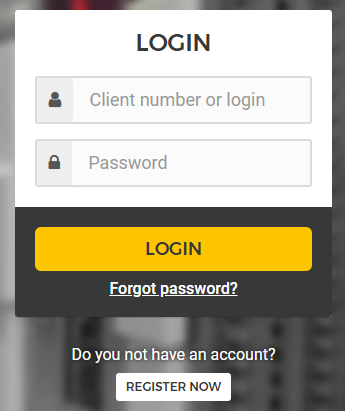
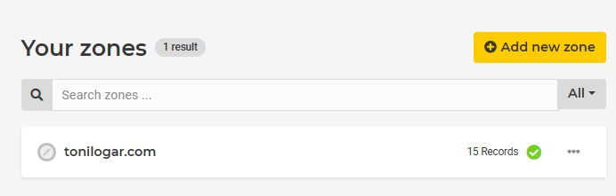

# Hetzner login, domain & tokens

## Index

1. [Create Hetzner user](#1-create-hetzner-user)
2. [Buy domain](#2-buy-domain)
3. [Create Hetzner API tokens](#3-create-hetzner-api-tokens)
4. [Expose tokens via environment](#4-expose-tokens-via-environment)
5. [Next steps](#5-next-steps)


---

## 1 Create Hetzner user

[Create user or login →](https://accounts.hetzner.com/login)



[←Index](#index)

## 2 Buy domain

We use Let's Encrypt, so a real domain is mandatory.

- Ownership verification stays under your control.  
- Certificates renew automatically even if the IP changes.  
- Wildcard SSL lets us reuse the same cert for all subdomains.

- ❌ `https://5.75.244.206`  
- ✅ `https://yourdomain.com`

[Search and buy domain](https://www.hetzner.com/whois/) →


[Create DNS zone for the domain](https://dns.hetzner.com/) →  
  


Quick check:

```bash
nslookup tonilogar.com  # Shows current IP
```

[←Index](#index)

## 3 Create Hetzner API tokens

Create a project in https://console.hetzner.cloud and generate a Cloud API token.


Generate a DNS API token at https://dns.hetzner.com/settings/api-token.


[←Index](#index)

## 4 Expose tokens via environment

Store secrets outside version control (see `.gitignore`). Both `.env` files must export variables with the `TF_VAR_` prefix so Terraform can read them.

[.env.development](../.env.development)
```bash
TF_VAR_cloud_api_token="<hetzner-cloud-token>"
TF_VAR_dns_api_token="<hetzner-dns-token>"
TF_VAR_domain_name="<domain>"
TF_VAR_admin_email="<admin-email>"
TF_VAR_ssh_public_key_path="./ssh/id_ed25519_vps_hetzner.pub"
TF_VAR_ssh_key_name="id_ed25519_vps_hetzner"
TF_VAR_server_name="web-project-dev-server"
TF_VAR_server_image="ubuntu-24.04"
TF_VAR_server_type="cx22"
TF_VAR_server_location="fsn1"
TF_VAR_docker_compose_version="v2.24.0"
TF_VAR_subdomains_to_register='["www","satellite","portfolio"]'
TF_VAR_project_label="web_project_hetzner_vps_server"
```

[.env.production](../.env.production)
```bash
TF_VAR_cloud_api_token="<hetzner-cloud-token>"
TF_VAR_dns_api_token="<hetzner-dns-token>"
TF_VAR_domain_name="<domain>"
TF_VAR_admin_email="<admin-email>"
TF_VAR_ssh_public_key_path="./ssh/id_ed25519_vps_hetzner.pub"
TF_VAR_ssh_key_name="id_ed25519_vps_hetzner"
TF_VAR_server_name="web-project-prod-server"
TF_VAR_server_image="ubuntu-24.04"
TF_VAR_server_type="cx22"
TF_VAR_server_location="fsn1"
TF_VAR_docker_compose_version="v2.24.0"
TF_VAR_subdomains_to_register='["www","satellite","portfolio"]'
TF_VAR_project_label="web_project_hetzner_vps_server"
```

> Note: declare lists such as `TF_VAR_subdomains_to_register` as valid JSON.  
> If you already run a VPS and only want Terraform to manage DNS, provide `TF_VAR_existing_server_ipv4`.

[←Index](#index)

## 5 Next steps

- [003_terraform](./003_terraform.md)
