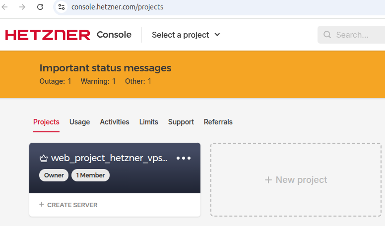

# Terraform

## Index

1. [Install latest terraform version](#1-install-latest-terraform-version)
2. [Create private and public SSH key](#2-create-private-and-public-ssh-key)
3. [Create Hetzner API tokens](#3-create-hetzner-api-tokens)
4. [Expose tokens via environment](#4-expose-tokens-via-environment)
5. [Terraform project scaffold](#5-terraform-project-scaffold)


---

## 1 Install latest terraform version

[Install terraform→](https://developer.hashicorp.com/terraform/install) 


[←index](#terraform)

## 2 Create private and public SSH key  

Create ssh folder and generate a key pair for the Hetzner VPS and keep it outside version control.   

```bash
mkdir -p 002_terraform/ssh
ssh-keygen -t ed25519 \
  -f 002_terraform/ssh/id_ed25519_vps_hetzner \
  -C "tonilogardev@id_ed25519_vps_hetzner" \
  -N ""
```

```bash
Generating public/private ed25519 key pair.
Your identification has been saved in 002_terraform/ssh/id_ed25519_vps_hetzner
Your public key has been saved in 002_terraform/ssh/id_ed25519_vps_hetzner.pub
The key fingerprint is:
SHA256:alo/NiKniMWcTkK4oOKQJdqE9nOC2sPNgcFZDjMgzuI tonilogardev@id_ed25519_vps_hetzner
The key's randomart image is:
+--[ED25519 256]--+
|o.               |
|+ + .            |
|.+ B             |
|*X+..  .         |
|OoB* o+          |
|=Bo.B+o.+        |
|o.+.o+ o.o       |
+----[SHA256]-----+
```

Restrict permissions.

```bash
chmod 600 002_terraform/ssh/id_ed25519_vps_hetzner
```

Test permissions.

```bash
ls -l 002_terraform/ssh/id_ed25519_vps_hetzner
```
Output

```bash
-rw------- 1 tonilogar tonilogar 484 Apr 24 09:22 002_terraform/ssh/id_ed25519_vps_hetzner
```

[←Index](#index)


## 3 Create Hetzner API tokens

Enter https://console.hetzner.cloud and create a new project.



Enter in project and generate cloud API token.


Enter https://dns.hetzner.com/settings/api-token and generate dns API token.


[←Index](#index)

## 4 Expose tokens via environment

Store the secrets outside the repository (see `.gitignore`).  
Each `.env` file must export the variables with the `TF_VAR_` prefix so Terraform picks them up automatically.


[.env.development](../.env.development) 
```bash
TF_VAR_cloud_api_token="<hetzner-cloud-token>"
TF_VAR_dns_api_token="<hetzner-dns-token>"
TF_VAR_domain_name="<domain>"
TF_VAR_admin_email="<admin-email>"
TF_VAR_ssh_public_key_path="./ssh/id_ed25519_vps_hetzner.pub"
TF_VAR_ssh_key_name="id_ed25519_vps_hetzner"
TF_VAR_server_name="web-project-dev-server"
TF_VAR_server_image="ubuntu-24.04"
TF_VAR_server_type="cx22"
TF_VAR_server_location="fsn1"
TF_VAR_docker_compose_version="v2.24.0"
TF_VAR_subdomains_to_register='["www","satellite","portfolio"]'
TF_VAR_project_label="web_project_hetzner_vps_server"
```

[.env.production](../.env.production) 
```bash
TF_VAR_cloud_api_token="<hetzner-cloud-token>"
TF_VAR_dns_api_token="<hetzner-dns-token>"
TF_VAR_domain_name="<domain>"
TF_VAR_admin_email="<admin-email>"
TF_VAR_ssh_public_key_path="./ssh/id_ed25519_vps_hetzner.pub"
TF_VAR_ssh_key_name="id_ed25519_vps_hetzner"
TF_VAR_server_name="web-project-prod-server"
TF_VAR_server_image="ubuntu-24.04"
TF_VAR_server_type="cx22"
TF_VAR_server_location="fsn1"
TF_VAR_docker_compose_version="v2.24.0"
TF_VAR_subdomains_to_register='["www","satellite","portfolio"]'
TF_VAR_project_label="web_project_hetzner_vps_server"
```

> Nota: las listas (`TF_VAR_subdomains_to_register`) deben declararse en formato JSON válido.
> Si ya tienes una VPS activa y solo quieres gestionar DNS, añade `TF_VAR_existing_server_ipv4`.

Load the file before running Terraform.

```bash
set -a
source .env.development   # or .env.production
set +a
terraform -chdir=002_terraform init
```

> Run the same block with `.env.production` when you need production values.

Basic workflow to refresh providers and preview changes:

```bash
set -a
source .env.development
set +a
rm -rf 002_terraform/.terraform
terraform -chdir=002_terraform init -upgrade
terraform -chdir=002_terraform plan
```

[←Index](#index)

## 5 Terraform project scaffold

Directory layout under `002_terraform/`.

```
002_terraform/
├── dns.tf                   # DNS records in Hetzner DNS
├── outputs.tf               # Exported values (IPs, zone info)
├── providers.tf             # hcloud and hetznerdns providers
├── scripts/
│   └── init_server.sh.tpl   # cloud-init bootstrap script
├── server.tf                # VPS + SSH key definition
├── variables.tf             # Definitions for all input variables
└── ssh/
    ├── id_ed25519_vps_hetzner
    └── id_ed25519_vps_hetzner.pub
```

