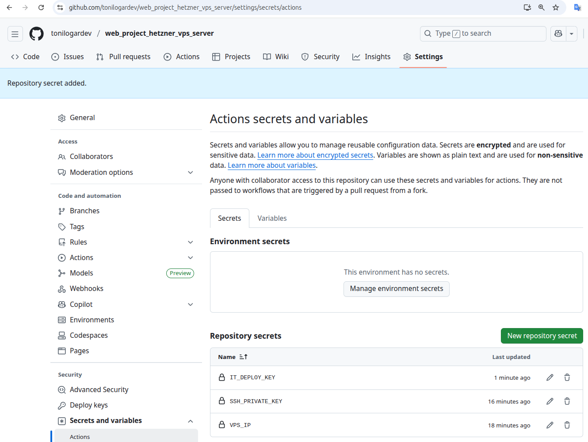

# GitHub Actions

## Index

1. [Create deploy SSH key](#1-create-deploy-ssh-key)
2. [Add GitHub secrets](#2-add-github-secrets)
3. [Deploy workflow overview](#3-deploy-workflow-overview)


---

## 1 Create deploy SSH key

Keep the deploy credentials under `003_ssh/` so the repository structure stays consistent across environments.

```bash
mkdir -p 003_ssh
ssh-keygen -t ed25519 -f 003_ssh/github_deploy_key -C "deploy-key"
ls -l 003_ssh/github_deploy_key
```

- Upload the contents of `003_ssh/github_deploy_key.pub` to **GitHub → Settings → Deploy keys** (read-only).
- Store the private key `003_ssh/github_deploy_key` in the GitHub Actions secret `GIT_DEPLOY_KEY`.

[←Index](#index)

## 2 Add GitHub secrets

Open repository settings and create the Actions secrets required by the deployment workflow.



Create the following entries:

- `VPS_IP`: Hetzner VPS public IPv4.
- `SSH_PRIVATE_KEY`: contents of `002_terraform/ssh/id_ed25519_vps_hetzner`.
- `GIT_DEPLOY_KEY`: contents of `003_ssh/github_deploy_key`.

[←Index](#index)

## 3 Deploy workflow overview

File: `.github/workflows/deploy.yml`

Triggered on pushes to `main` and `main_dev_pro`. The job connects to the VPS over SSH using `appleboy/ssh-action`, fetches the branch from GitHub with the deploy key, reloads `.env.production`, and runs:

```bash
ENVIRONMENT=production docker compose up -d --build --remove-orphans
```

It keeps containers updated, removes orphan services, and prints `docker compose ps` for quick status checks.

[←Index](#index)
